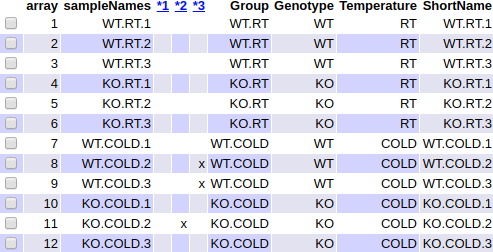

```{r setup, include=FALSE}
require(knitr)
knitr::opts_chunk$set(echo = TRUE, message = FALSE, warning = FALSE, 
                      comment = NA, prompt = TRUE, tidy = FALSE, 
                      fig.width = 7, fig.height = 7, fig_caption = TRUE,
                      cache=FALSE)
Sys.setlocale("LC_TIME", "C")
```

```{r echo=FALSE}
if(!(require(printr))) {
  install.packages(
    'printr',
    type = 'source',
    repos = c('http://yihui.name/xran', 'http://cran.rstudio.com')
  )
}
```


# Summary/Abstract

Microarray data analysis has been one of the most important hits in the interaction between statistics and bioinformatics in the last two decades. The analysis of microarray data can be done in different ways using different tools. In this chapter a typical workflow for analyzing microarray data using R and Bioconductor packages is presented. The workflow starts with the raw data -binary files obtained from the hybridization process- and goes through a series of steps: Reading raw data, Quality Check, Normalization, Filtering, Selection of differentially expressed genes, Comparison of selected lists and Analysis of Biological Significance. The implementation of each step in R is described through a use case that goes from raw data until the analysis of biological significance. Data and code for the analysis are provided in a github repository^[https://github.com/alexsanchezpla/StatisticalAnalysisOfMicroarrayData].
 
# Key Words

Microarrays, Bioconductor, R, Differential Expression

# Introduction

Microarray data analysis is one of the clearest cases where interaction between bioinformatics and statistics has been  highly beneficial for both disciplines. Efron @Efron2013 even calls the 21st century as the century of microarrays. 

What is generically described as "microarray data analysis" is a process that starts with the design of the experiment intended to answer with one or more biological questions and ends with a tentative answer for these questions. Statistics is involved at every step of this process, for preparing, transforming visualizing or analyzing data. And, of course, every step can be done in different way that use either classical statistics or new methods developed ad-hoc for these often high dimensional problems. The detailed description of these steps is out of the scope of this chapter and the reader is assumed to be familiar with them. It is assumed that the reader is already familiar with microarrays such as they are introduced in @Sanchez-Pla2014 and also with the general ideas of microarray data analysis such as can be found in @Draghici2012. In any case, for the sake of completeness basic ideas will be briefly introduced and citations provided the first time they are discussed.

For our objectives we can assume that a microarray dataset is a matrix of continuous values that represent the expressions of a set of genes (one gene per row), in a variety of conditions or samples (one sample per column). See figure \@ref(fig:dataset) for an example.

```{r dataset, fig.cap="A simplified view of a gene expression matrix", echo=FALSE}
knitr::include_graphics("figures/Figure1.jpg")
```

Note that we have described the row contents as "genes". Strictly speaking depending on the type of array, each row may correspond to one distinct, but related, entity, a "probeset" or a "transcript".

- A transcript describes how the gene has been transcribed into messenger RNA. If transcription was unique there would be a single transcript per gene. However, due to the phenomenon of alternative splicing, @Sanchez-Pla2012, there may be different transcriptions of the same gene (the associated proteins are called "isoforms"). That there may be multiple transcripts per gene.
- A probeset is, as indicated by its name, a set of "probes", which are designed to map different fragments of a given gene. Altogether it is expected that each set of probes, or probeset, uniquely characterizes one gene. However, given that this characterization is not always possible it may be convenient to have more than one probeset per gene. That is although it is common to exchange the terms "probeset" and "gene", it is important to be aware that there may be severalprobestes per each gene.

In practice, given that either probesets or transcripts map to genes, it is common to describe the array rows as "genes".

Our main goal is to describe a workflow, a series of ordered steps that takes us from the raw data, the digitized images as produced by the hybridization system, to one or more lists of genes that can be used to help answering a certain biological question.
This can be done in distinct ways. What we present here is an approach that has become very popular along the last decades based on analyzing the data from the images to the lists of genes, using the R Statistical language and some of the packages developed specifically for this in the Bioconductor project.

A summary of the process can be found in figure \@ref(fig:MDAProcess).

```{r MDAProcess, fig.cap="The microarray data analysis process", echo=FALSE}
knitr::include_graphics("figures/Figure2.png")
```

# Materials

In this section we list all the materials needed to perform a microarray data analysis. 

## Software

First of all it is needed to install the software to perform all the required calculations. 

There are many options are available @Mehta2011  but one of the most common approaches is to use the __R statistical software__. R can be downloaded from its web page (https://cran.r-project.org/index.html) and installed following the instructions described there. The microarray analysis presented in this chapter has been performed with the latest version of R which, at the moment of writing, was 3.4.4. 

R is a console based software. Its use can be facilitated with an additional interface called "R-Studio". It can be downloaded and installed following the instructions listed in its web page: https://www.rstudio.com/. Although its use is not compulsory for reproducing the analyses in this chapter it is highly recommended to work with R using this interface.

When working with R  it is often required to use some functions not available in the basic installation. This can be done by installing additional libraries, also called "packages", developed by the scientific community. Most packages used for the analysis of high throughput genomic data are part of the Bioconductor project which started with a few packages in 2002 and has now more than one thousand (https://www.bioconductor.org/). Indeed Bioconductor has become the state-of-the-art way to analyze microarray and other omics data and it has grown from hardly a dozen packages in 2002 to the current number of more than one thousand. The analysis presented have been performed using Bioconductor version 3.6.

R and Bioconductor are open source free software. This has many advantages but it may sometimes be a problem, especially when new functionalities are not compatible with previous versions (see Note 1).

Table \@ref(tab:packagesList) shows the packages needed for the analysis presented in this chapter. The table contains the name, the source and a short description of all the packages that have to be install to run the current case study. In the following section we will show the code necessary to install all of them. 


## Data 

This protocol is applied on a dataset from a published study @LiE7111. The data had been uploaded into the Gene Expression Omnibus (GEO) database, an international public repository that archives and freely distributes high-throughput gene expression and other functional genomics data sets @Clough2016. The dataset selected is identified with the accession number: __GSE100924__. 

The study that generated the data investigated the function of gene `ZBTB7B` (http://www.genecards.org/cgi-bin/carddisp.pl?gene=ZBTB7B). This gene activates the thermogenic gene program during brown and beige adipocyte differentiation regulating brown fat gene expression at ambient room temperature and following cold exposure. The experiment compared 10 weeks old mice with the gene deactivated ("KO" or knockout) or not ("WT" or Wild type) at two different temperatures, ambient room temperature (RT, $22^{\circ}$C) or following cold exposure (COLD, $4^{\circ}$C) for 4 hrs. That is, it was a $2\times2$ factorial design (genotype and temperature) with two levels each (wild type and knock out, for genotype, and room temperature and cold, for temperature). The sample size of the experiment is 12 samples, three replicates of each group. 

The microarrays used for this experiment were of type Mouse Gene 2.1 from Affymetrix, now Thermofisher, one of the most popular vendors of microarray technology.


# Methods

## Environment preparation:

In a microarray data analysis project, data analyst will have to manage a lot of files, including the files with the raw data (.CEL files) and the files generated during the analysis of them. For this reason, it is very advisable to define some folders before beginning with the analysis to try to not get lost, if all the files go to the same folder. We strongly recommend that user creates the following folders:

  + A main folder that will be the "working directory" called for example "MicroarraysAnalysis"
  + A folder called, for example __data__ located within the working directory: Here we will save all the _.CEL_ files and the _targets_ file with information on the covariates, described in next section.
  + A folder called, for example __results__ located within the working directory: Here we will send all the results obtained in the microarray analysis.

The following commands create the desired folders. This can be made from within R as described, or using a visual file browser such as Windows File Explorer or any other (in that case you can omit this step):

```{r CreateFolders, warning=FALSE, eval=FALSE}
setwd(".")
dir.create("data")
dir.create("results")
```

The code for running this analysis, that can be easily adapted to run similar studies can be downloaded from a github repository specifically devoted to this chapter. In the following sections it is assumed that such code has been downloaded and copied into the working directory. The url for the repository is: [https://github.com/alexsanchezpla/StatisticalAnalysisOfMicroarrayData](https://github.com/alexsanchezpla/StatisticalAnalysisOfMicroarrayData). 

Once it is saved, open R-Studio, open the file with the R code, and in R-Studio go to the menu option in the top "Session -> Set working directory -> To source file location". This action will set the folder we have set as "main" folder as our working directory

## Prepare the data for the analysis

The data for the analysis will be provided as two types of files, the "CEL"" files and the "targets" file. 

CEL files are the files with the "raw data" originated after microarray scanning and preprocessing with Affymetrix software. This files need to be saved  into the __data__ folder. Usually one expectes to have a .CEL file for each sample in the experiment.

Another file needed for the analysis is the _targets_ file, which contains the information on groups and covariates. That is, this file relates the name of each .CEL file with their condition in the experiment. We can use the targets to retain all the information valuable for the analysis like other covariables. 

Although the targets file need not have any fixed names it is practical to use its column names to create labels that will be used later. For example:

  - Column called _FileName_: It may contain the exact name of the CEL files in the data folder
  - Column called _Group_: It may summarize the conditions in the experiment for that sample.
  - Column called _ShortName_: It may be used to store a short label of the sample useful for some plots.
  - There may be other columns to store covariables in the study such as sex, age, etc.
  
For this analysis, targets file has been saved in .csv format, separated by semicolon, although any other format that works for delimited text files might have been used (see Note 2). Table \@ref(tab:ReadTargets) shows the contents of the targets file used in this analysis.

```{r ReadTargets}
targets <- read.csv2("./data/targets.csv", header = TRUE, sep = ";") 
knitr::kable(
  targets, booktabs = TRUE,
  caption = 'Content of the targets file used for the current analysis')
```

## Packages installation in R

Packages not available in the basic R installation need to be installed before the analysis can be done (see Note 3).

As commented in _Materials_ section, packages needed to do the study, may be downloaded from distinct repositories. The most common ones will be CRAN for standard packages or Bioconductor for Bioconductor packages.

Standard R packages can be downloades and installed from default repositories with the `install.packages` function. 
Bioconductor packages can be downloaded and installed with the function `install()` from the `BiocManager` package. 

The code below will download and install the packages needed for the analysis. Note that __this code must be executed only once__. Subsequent executions of the analysis do not need to re-install the packages:

The first chunk makes a fresh install of basic bioconductor packages.
```{r installBioC, message=FALSE, warning=FALSE, eval=FALSE}
if (!requireNamespace("BiocManager", quietly = TRUE))
    install.packages("BiocManager")
BiocManager::install()
```
The second chunk installs packages specifically needed for this study.Some packages may require compilation, so a good idea if you are not working on a linux machine, is to have `Rtools` installed. This can be downladed from [https://cran.r-project.org/bin/windows/Rtools/](https://cran.r-project.org/bin/windows/Rtools/).

```{r installPackages, message=FALSE, warning=FALSE, eval=FALSE}
install.packages("knitr")
install.packages("colorspace")
install.packages("gplots")
install.packages("ggplot2")
install.packages("ggrepel")
install.packages("htmlTable")
install.packages("prettydoc")
install.packages("devtools")
install.packages("BiocManager")
BiocManager::install("oligo")
BiocManager::install("pd.mogene.2.1.st")
BiocManager::install("arrayQualityMetrics")
BiocManager::install("pvca")
# NOT NEEDED UNTIL ANALYSES ARE PERFORMED
# BiocManager::install("limma")
# BiocManager::install("genefilter")
# BiocManager::install("mogene21sttranscriptcluster.db")
# BiocManager::install("annotate")
# BiocManager::install("org.Mm.eg.db")
# BiocManager::install("ReactomePA")
```

##  __Read the CEL files__

Next step is to read the raw data (CEL files) and to store in a variable (in this case we have called it **rawData**). First we have to load the package _oligo_ with the function _library_. In this package are coded the functions to read the CEL files. Take attention to put the correct folder where the CEL files are saved when executing _list.celfiles_ function. 

```{r ReadCELfiles, message=FALSE, results='hide', warning=FALSE}
require(oligo)
celFiles <- list.celfiles("./data", full.names = TRUE)
require(Biobase)
my.targets <-read.AnnotatedDataFrame(file.path("./data","targets.csv"), 
                                     header = TRUE, row.names = 1, 
                                     sep=";") 
rawData <- read.celfiles(celFiles, phenoData = my.targets)
```

Note that we have read another time the targets file, but now using another specific function: _read.AnnotatedDataFrame_, and stored in a new variable called _my.targets_. We have done that to associate the information stored in the CEL files with the targets file in on single variable with the last code's line. This object is called _ExpressionSet_ and is designed to combine several different sources of information into a single convenient structure. We could store in this object all the information available about the experiment performed (protocol used, experiment data, microarray type,...). Moreover it allow us to change the long name of the samples, for the short and more comprehensive label previously coded in _ShortName_ column of the _targets_.

```{r ChangeName}
my.targets@data$ShortName->rownames(pData(rawData))
colnames(rawData) <-rownames(pData(rawData)) 

head(rawData)
```

## __Quality control of raw data__

Once the raw data is loaded it is the moment to check if the data have enough quality for normalization. This step is very important since bad quality data could introduce a lot of noise in the analysis, that normalization process could not solve. ArrayQualityMetrics package performs different quality approaches, like boxplot of the intensity of the data and Principal Component Analysis (PCA) among others. If one array is above a certain threshold defined in the function it is marked with an asterisk as an outlier. When a certain array is marked three times it should be revised carefully, perhaps this sample will have to be rejected to improve the overall quality of the experiment.
First step is to load the library to gain access to the function. Be careful again to specify correctly the destination folder of the results:

```{r QCRaw, message=FALSE, warning=FALSE, eval=FALSE}
library(arrayQualityMetrics)
arrayQualityMetrics(rawData)
```

We have to check the results of the quality analysis in a recently created QCDir.Raw folder inside the results folder previously created. Inside this folder we have to look for a file called _index.html_, which opens a web page from where we will be able to access a summary of the analysis performed. The image in figure \@ref(fig:QCRawDataRes) shows the header of this file which contains a table with three columns indicating some quality criteria that should be verified by "good quality" arrays. In this example three samples have been marked once. Usually if there is only one mark it means that potential problems are small so we can decide to keep all the arrays in the analyis.

```{r QCRawDataRes, fig.cap="Aspect of the summary table, in the index.html file, produced by the arrayQualityMetrics package on the raw data", echo=FALSE}

```

A more comprehensive principal component analysis can be obtained using a function specifically  design for that. The code for this function is shown in the next code chunk.

```{r}
require(ggplot2)
require(ggrepel)
plotPCA3 <- function (datos, labels, factor, title, scale,colores, size = 1.5, glineas = 0.25) {
  data <- prcomp(t(datos),scale=scale)
  # plot adjustments
  dataDf <- data.frame(data$x)
  Group <- factor
  loads <- round(data$sdev^2/sum(data$sdev^2)*100,1)
  # main plot
  p1 <- ggplot(dataDf,aes(x=PC1, y=PC2)) +
    theme_classic() +
    geom_hline(yintercept = 0, color = "gray70") +
    geom_vline(xintercept = 0, color = "gray70") +
    geom_point(aes(color = Group), alpha = 0.55, size = 3) +
    coord_cartesian(xlim = c(min(data$x[,1])-5,max(data$x[,1])+5)) +
    scale_fill_discrete(name = "Group")
  # avoiding labels superposition
  p1 + geom_text_repel(aes(y = PC2 + 0.25, label = labels),segment.size = 0.25, size = size) + 
    labs(x = c(paste("PC1",loads[1],"%")),y=c(paste("PC2",loads[2],"%"))) +  
    ggtitle(paste("Principal Component Analysis for: ",title,sep=" "))+ 
    theme(plot.title = element_text(hjust = 0.5)) +
    scale_color_manual(values=colores)
  }
```

Figure \@ref(fig:PCARaw) shows the scatterplot of the first two principal components performed on the raw data.

```{r PCARaw, message=FALSE, fig.cap="Visualization of the two first Principal Components for raw data"}
plotPCA3(exprs(rawData), labels = targets$ShortName, factor = targets$Group, 
         title="Raw data", scale = FALSE, size = 3, 
         colores = c("red", "blue", "green", "yellow"))
```

Note that we have defined in the function some parameters to facilitate the visualization.

  + the label of the samples, remember that it is coded in the _ShortName_ column of the targets
  + the characteristic to color the samples, coded in the _Group_ column in targets
  + the colors of each group

If necessary, it is easy to save the plots to a _tiff_ file with the following code:

```{r savePCAraw, echo=TRUE, results='hide'}
tiff("figures/PCA_RawData.tiff", res = 200, width = 4.5, height = 4, units = 'in')
plotPCA3(exprs(rawData), labels = targets$ShortName, factor = targets$Group, 
         title="Raw data", scale = FALSE, size = 2, 
         colores = c("red", "blue", "green", "yellow"))
dev.off()
```

First component of the PCA accounts for 55.9% of the total variability of the samples, and as we can observe in the plot, this variability is mainly contributed by the _temperature_ condition since samples incubated to 4 degrees are on the right and samples incubated at room temperature are on the left.

In the same way, we can easily visualize the intensity distribution of the arrays using boxplots. Figure \@ref(fig:BoxplotRaw) shows a multiple boxplot depicting the distribution of the intensities along all samples.

```{r BoxplotRaw, message=FALSE, fig.cap="Boxplot for arrays intensities (Raw Data)"}
boxplot(rawData, cex.axis=0.5, las=2,  which="all", 
         col = c(rep("red", 3), rep("blue", 3), rep("green", 3), rep("yellow", 3)),
         main="Distribution of raw intensity values")
```

```{r saveIntensRaw, echo=FALSE, results='hide'}
tiff("figures/Intensity_RawData.tiff", res = 200, width = 4, height = 4, units = 'in')
boxplot(rawData, cex.axis=0.5, las=2,  which="all", 
         col = c(rep("red", 3), rep("blue", 3), rep("green", 3), rep("yellow", 3)),
         main="Distribution of raw intensity values")
dev.off()
```


A light variation of intensity among arrays is observed, but this is the expected for raw data.

## __Data normalization__

Before beginning with differential expression analysis, it is necessary to make the arrays comparable among them and try to reduce, and if it is possible to eliminate, all the variability in the samples not owing to biological reasons.Normalization process tries to assure that intensity differences present in the array, reflects the differential expression of the genes, rather than artificial biases due to technical issues. Normalization process consists of three discrete steps: background correction, normalization, and summarization. Most commonly used method for array normalization is Robust Multichip Analysis @rmaIri:

```{r Normalization}
eset_rma <- rma(rawData)
```

## __Quality control of normalized data__

After performing normalization it is interesting to perform again a quality control to check how data looks. In the same way than before (look we have changed _rawData_ object to *eset_rma*).

```{r QCNorm, message=FALSE, warning=FALSE, eval=FALSE}
arrayQualityMetrics(eset_rma, outdir = file.path("./results", "QCDir.Norm"), force=TRUE)
```

Figure \@ref(fig:QCNormDataRes) shows the same summary as before, but performed on normalized data.

```{r QCNormDataRes, fig.cap="Aspect of the summary table, in the index.html file, produced by the arrayQualityMetrics package on normalized data", echo=FALSE}
knitr::include_graphics("figures/Figure6.png")
```

Figure \@ref(fig:PCANorm) shows the scatterplot of the first two principal components performed on normalized data.  

```{r PCANorm, message=FALSE, fig.cap="Visualization of first two principal components for normalized data"}
plotPCA3(exprs(eset_rma), labels = targets$ShortName, factor = targets$Group, 
         title="Normalized data", scale = FALSE, size = 3, 
         colores = c("red", "blue", "green", "yellow"))
```

```{r savePCAnorm, echo=FALSE, results='hide'}
tiff("figures/PCA_NormData.tiff", res = 150, width = 5, height = 5, units = 'in')
plotPCA3(exprs(eset_rma), labels = targets$ShortName, factor = targets$Group, 
         title="Normalized data", scale = FALSE, size = 2, 
         colores = c("red", "blue", "green", "yellow"))
dev.off()
```

Now first component accounts for 33% of the total variability. Notice that the percentage of explained variability has decreased with respect to PCA performed on raw data. Similarly as with the PCA with raw data, it separates samples from _COLD_ level of _temperature_ condition on the right, and samples from _RT_ level on the left. It is important to note that there are one sample from group _KO.RT_ that groups near __WT.RT__ and viceversa. It could be an issue of mislabeling of samples that should be checked with the laboratory that has processed the samples.

Figure \@ref(fig:BoxplotNorm) shows a multiple boxplot depicting the distribution of the normalized intensities along all samples. Notice that all boxplots have the same aspect. This suggests that the normalization has worked fine. However it is important to be aware that RMA includes a step ("quantile normalization") where the empirical distribution of all the samples is set to the same values. As a consequence __it is expected that the boxplots are identical or at least very similar__.

```{r BoxplotNorm, message=FALSE, fig.cap="Distribution of  intensities for normalized data"}
boxplot(eset_rma, cex.axis=0.5, las=2,  which="all", 
         col = c(rep("red", 3), rep("blue", 3), rep("green", 3), rep("yellow", 3)),
         main="Boxplot for arrays intensity: Normalized Data")
```

```{r saveIntensNorm, echo=FALSE, results='hide'}
tiff("figures/Intensity_NormData.tiff", res = 150, width = 5, height = 5, units = 'in')
boxplot(eset_rma, cex.axis=0.5, las=2,  which="all", 
         col = c(rep("red", 3), rep("blue", 3), rep("green", 3), rep("yellow", 3)),
         main="Boxplot for arrays intensity: Normalized Data")
dev.off()
```

## __Batch detection__

Gene expression microarray results can be affected by minuscule differences in any number of non-biological variables like reagents from different lots, different technicians and the more usual issue the different processing date of samples from the same experiment. The cumulative error introduced by these time and place-dependent experimental variations is referred to as "batch effects". Different approaches have been developed for identifying and removing batch effects from microarray data like surrogate variable analysis, Combat and Principal variation component analysis (PVCA). 

Here we will use the last one, Principal Variation Component Analysis, which estimates source and proportion of variation in two steps, principal component analysis, and variance component analysis. Only for illustration purposes we have added a new column to our targets file, with a fictitious sample processing date. We will perform the PVCA analysis before and after adding this columns to see the differences:

```{r BatchDetection, message=FALSE, warning=FALSE}
#load the library
require(pvca)
pData(eset_rma) <- targets
#select the threshold
pct_threshold <- 0.6
#select the factors to analyze
batch.factors <- c("Genotype", "Temperature")
#run the analysis
pvcaObj <- pvcaBatchAssess (eset_rma, batch.factors, pct_threshold)
```

Figure \@ref(fig:plotPVCA) shows a bar diagram with one bar per each source of variation included in the analysis. Their relative size indicates the percentage of variability attributable to each source. The plot shows that the main source of variation in the samples is the _Temperature_ condition. This was also observed on the PCA plots on raw and normalized data in figures \@ref(fig:PCARaw) and \@ref(fig:PCANorm).


```{r plotPVCA, fig.cap="Relative importance of the different factors -genotype, temperature and interaction- affecting gene expression"}
#plot the results
bp <- barplot(pvcaObj$dat, xlab = "Effects",
  ylab = "Weighted average proportion variance",
  ylim= c(0,1.1),col = c("mediumorchid"), las=2,
  main="PVCA estimation")
axis(1, at = bp, labels = pvcaObj$label, cex.axis = 0.55, las=2)
values = pvcaObj$dat
new_values = round(values , 3)
text(bp,pvcaObj$dat,labels = new_values, pos=3, cex = 0.5)
```

```{r savePVCAplot, echo=FALSE, results='hide'}
tiff("figures/PVCAplot.tiff", res = 150, width = 5, height = 5, units = 'in')
bp <- barplot(pvcaObj$dat, xlab = "Effects",
  ylab = "Weighted average proportion variance",
  ylim= c(0,1.1),col = c("mediumorchid"), las=2,
  main="PVCA estimation")
axis(1, at = bp, labels = pvcaObj$label, cex.axis = 0.45, las=2)
values = pvcaObj$dat
new_values = round(values , 3)
text(bp,pvcaObj$dat,labels = new_values, pos=3, cex = 0.5)
dev.off()
```

# References
